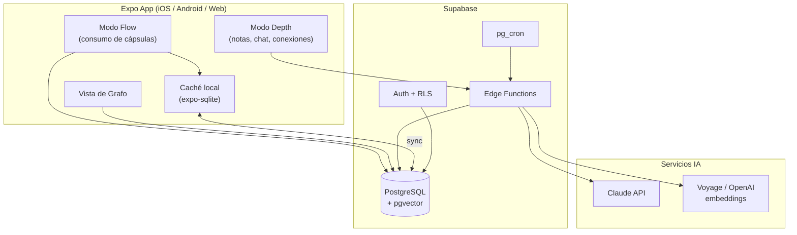

# Cortex — Plan de Producto y Arquitectura

> **Documento de handoff para Claude Code.** Nombre en clave: **Cortex** (provisional).
> Proyecto personal de Juan Ortiz Romero. Disciplina bilingüe: **UI y contenido en español, código/variables/identificadores en inglés.**
> Este documento es la fuente de verdad. Construir por fases (ver §12). No implementar todo de golpe.

---

## 1. Tesis del producto (leer antes de tocar código)

Cortex **no es** "TikTok educativo". Esa categoría está llena de cadáveres (Blinkist, Imprint, Headway, Snack) porque confunden el *formato* de TikTok con lo que engancha de TikTok.

Lo que engancha de TikTok es la **recompensa variable**: no sabes si lo siguiente será oro o basura. El contenido educativo, por defecto, es predecible — y la predicción mata la dopamina.

La apuesta de Cortex es reproducir la recompensa variable **sin sacrificar profundidad**, mediante tres mecanismos:

1. **Mezcla impredecible de fuentes.** El usuario tiene varios temas activos (un libro, una skill, conceptos sueltos). Al abrir la app no sabe si la siguiente cápsula será del libro, de la skill, o un **puente** inesperado entre dos de sus temas. Esa incertidumbre es el sustituto de la basura aleatoria de TikTok.
2. **Diseño anti-adicción deliberado.** Una cápsula por apertura. Sin autoplay. Sin feed infinito. Si quieres otra, la pides. Cortex reemplaza el *momento* de abrir TikTok, no la experiencia de scroll infinito. La retención no se busca por adicción sino por **identidad**: "soy alguien que en tiempos muertos aprende, no hace scroll".
3. **Capa activa (no solo consumo).** El usuario puede expandir cualquier idea, preguntarle a la IA con contexto de todo lo que ha visto, escribir su propia reflexión, y conectar conceptos entre temas. Esto construye un **grafo de conocimiento personal** que, a su vez, alimenta el algoritmo.

### Principios de diseño no negociables
- **NUNCA** autoplay ni feed infinito. Una cápsula → fin. Botón explícito "Otra".
- **NUNCA** convertir la capa activa en Notion. Guardar = un gesto. Escribir = tan rápido como un WhatsApp. Conectar = arrastrar un nodo sobre otro. Cero carpetas, cero jerarquías manuales, cero formularios. La estructura la pone el grafo automáticamente.
- La **variedad de formato es parte de la recompensa variable**. No todo es texto.
- El contenido generado por IA debe ser **provocador y contraintuitivo**, no resúmenes capítulo a capítulo. Si se siente como flashcards glorificadas, el producto está muerto.

---

## 2. Modelo mental: dos modos, una app

### Modo Flow (consumo pasivo inteligente)
El que usas en el autobús, la cola del súper, el sofá. Abres → una cápsula de 30-180s → swipe vertical para avanzar dentro de la cápsula → al final, un micro-reto de reflexión → fin. Si quieres otra, la pides.

### Modo Depth (procesamiento activo)
Algo te llama la atención → toque para expandir la cápsula. Aparece un espacio con tres acciones:
- **Preguntar a la IA** sobre ese concepto, con contexto de tu grafo completo (no un chat de cero).
- **Escribir una reflexión** propia, asociada al concepto.
- **Conectar** ese concepto con otro que ya guardaste (crea una arista en tu grafo).

Los dos modos se retroalimentan: tus reflexiones y conexiones manuales se convierten en *input* del algoritmo que decide qué cápsulas (especialmente qué puentes) generar después. Tu pensamiento alimenta el feed.

---

## 3. Conceptos de dominio (vocabulario del proyecto)

| Concepto | Definición | Tabla |
|---|---|---|
| **Learning Queue** | Un tema activo que el usuario quiere aprender: un libro, una skill, un set de conceptos. | `learning_queues` |
| **Knowledge Atom** | La unidad atómica de conocimiento. Una idea autónoma, autocontenida, que tiene sentido sola. Es el ladrillo de todo. | `knowledge_atoms` |
| **Capsule** | Un *atom* (o varios) empaquetado con un formato concreto, listo para presentarse. Lo que el usuario consume. | `capsules` |
| **Bridge** | Una conexión entre dos *atoms* de temas distintos. Puede ser detectada por IA o creada por el usuario. Es la arista del grafo. | `bridges` |
| **Note** | Reflexión escrita por el usuario, asociada a un *atom*. | `user_notes` |
| **Interaction** | Telemetría de qué hizo el usuario con una cápsula (completó, saltó, guardó, expandió, respondió). Alimenta el algoritmo. | `capsule_interactions` |

**Grafo personal** = nodos (`knowledge_atoms` que el usuario ha guardado + `user_notes`) conectados por aristas (`bridges`).

---

## 4. Stack técnico

Decisiones alineadas con tu stack actual (Supabase, React, TS) y con la guía de arquitectura para dev solo: **monolito modular, Postgres por defecto.**

| Capa | Tecnología | Razón |
|---|---|---|
| App móvil | **Expo (React Native) + TypeScript** | Solo dev, iteración rápida, OTA updates, web export gratis. Los gestos y animaciones son el 50% de que se "sienta bien", así que nativo. |
| Animaciones / gestos | **React Native Reanimated 3 + Gesture Handler** | Swipe, transiciones de cápsula. 60fps en hilo de UI. |
| Render visual / grafo | **React Native Skia** | Cápsulas visuales y vista de grafo (force-directed). Alternativa: WebView con D3/Cytoscape si Skia se queda corto en el grafo. |
| Backend | **Supabase** (Postgres + RLS + pgvector + Edge Functions + Auth + Storage) | Ya lo dominas. RLS para aislamiento por usuario. pgvector para similitud semántica. |
| Generación IA | **Claude API** vía Edge Functions | Extracción de atoms, detección de puentes, chat contextual. Modelos: `claude-sonnet-4-6` (extracción), `claude-haiku-4-5` (clasificación barata), `claude-opus-4-8` (juicio de calidad de puentes). **Disciplina de API (verificado):** estos modelos NO aceptan `temperature`, `top_p` ni `budget_tokens` → devuelven 400. Controlar profundidad con `output_config: { effort: "low"\|"medium"\|"high" }` + `thinking: { type: "adaptive" }`. Para salida estructurada usar `output_config.format` (json_schema) — NUNCA prompting tipo "devuelve solo JSON". Cachear prefijos estables con `cache_control` (clave si se abre a usuarios, §14). |
| Embeddings | **Voyage AI** (p.ej. `voyage-3`, el proveedor que Anthropic recomienda) o, alternativa, **OpenAI `text-embedding-3-small`** | Claude no genera embeddings. Necesarios para pgvector y RAG. |
| Jobs en background | **pg_cron + tabla de cola** (`generation_jobs`) | La generación pesada NUNCA on-the-fly: la latencia mataría el Flow. Se pre-genera y cachea. |
| Caché local / offline | **expo-sqlite** + sync | Las cápsulas pre-generadas deben leerse offline (autobús, metro sin cobertura). |

---

## 5. Arquitectura general



Flujo de datos clave: **todo lo pesado ocurre asíncronamente** (extracción, embeddings, puentes, empaquetado de cápsulas) mediante jobs disparados por pg_cron o por inserción de una queue. El cliente solo lee cápsulas ya cocinadas. El único camino síncrono cliente→IA es el **chat contextual del Modo Depth** (con streaming).

> **Detalle de implementación (`Cron --> EF` en el diagrama):** `pg_cron` ejecuta SQL, NO llama Edge Functions directamente. Para disparar una EF desde cron hace falta la extensión `pg_net` (`net.http_post(url, headers, body)`) — habilitar `pg_cron` y `pg_net` en Supabase. Patrón: `pg_cron` corre cada N minutos → lee `generation_jobs` pendientes → `net.http_post` a la EF correspondiente. La EF también puede dispararse por webhook al insertar en la queue.

---

## 6. Modelo de base de datos

Postgres (Supabase). **RLS obligatorio en TODAS las tablas, aislamiento por `user_id`.** (Nota de seguridad: en Presupuestador hubo un fallo de multi-tenant; aquí no se repite — cada policy debe verificar `auth.uid() = user_id` y testearse con dos usuarios distintos antes de cerrar la fase.)

```sql
-- ============================================================
-- USERS: gestionado por Supabase Auth (auth.users)
-- Perfil extendido opcional:
-- ============================================================
create table profiles (
  id uuid primary key references auth.users(id) on delete cascade,
  display_name text,
  daily_capsule_goal int default 5,        -- identidad, no adicción
  created_at timestamptz default now()
);

-- ============================================================
-- LEARNING QUEUES: los temas activos del usuario
-- ============================================================
create type queue_type as enum ('book', 'skill', 'concept', 'topic');
create type queue_status as enum ('active', 'paused', 'completed');

create table learning_queues (
  id uuid primary key default gen_random_uuid(),
  user_id uuid not null references auth.users(id) on delete cascade,
  title text not null,                      -- "Atomic Habits", "Sistemas distribuidos"
  type queue_type not null,
  source_ref text,                          -- ISBN, URL, descripción libre de la fuente
  intent text,                              -- "quiero entender X relacionado con mi trabajo"
  status queue_status default 'active',
  created_at timestamptz default now()
);

-- ============================================================
-- KNOWLEDGE ATOMS: la unidad atómica de conocimiento
-- ============================================================
create type atom_kind as enum ('core_idea', 'counterintuitive', 'definition', 'example', 'principle');

create table knowledge_atoms (
  id uuid primary key default gen_random_uuid(),
  user_id uuid not null references auth.users(id) on delete cascade,
  queue_id uuid not null references learning_queues(id) on delete cascade,
  title text not null,                      -- titular corto, "gancho"
  body text not null,                       -- la idea desarrollada (1-3 párrafos máx)
  kind atom_kind not null,
  novelty_score float default 0.5,          -- 0-1, cuán contraintuitivo/provocador (gancho)
  order_index int not null,                 -- secuencia acumulativa dentro de la queue
  source_ref text,                          -- página, timestamp, sección
  embedding vector(1024),                   -- ajustar dim al modelo de embeddings elegido (voyage-3 = 1024)
  created_at timestamptz default now()
);
-- HNSW (no ivfflat): ivfflat necesita datos presentes para construir clusters; en una
-- migración inicial (tabla vacía) el recall queda pésimo hasta reindexar. HNSW da mejor
-- recall y para el volumen de un proyecto personal el costo de memoria es trivial.
create index on knowledge_atoms using hnsw (embedding vector_cosine_ops);

-- ============================================================
-- BRIDGES: conexiones entre atoms (las aristas del grafo)
-- ============================================================
create type bridge_origin as enum ('ai_detected', 'user_created');

create table bridges (
  id uuid primary key default gen_random_uuid(),
  user_id uuid not null references auth.users(id) on delete cascade,
  atom_a_id uuid not null references knowledge_atoms(id) on delete cascade,
  atom_b_id uuid not null references knowledge_atoms(id) on delete cascade,
  origin bridge_origin not null,
  rationale text,                           -- por qué conectan (clave para la cápsula puente)
  strength float default 0.5,               -- 0-1, peso de la arista
  created_at timestamptz default now(),
  unique (user_id, atom_a_id, atom_b_id)
);

-- ============================================================
-- CAPSULES: atoms empaquetados con formato, listos para servir
-- ============================================================
create type capsule_format as enum ('narrative', 'interactive', 'visual', 'bridge', 'recall');
create type capsule_status as enum ('queued', 'served', 'seen', 'archived');

create table capsules (
  id uuid primary key default gen_random_uuid(),
  user_id uuid not null references auth.users(id) on delete cascade,
  format capsule_format not null,
  primary_atom_id uuid references knowledge_atoms(id) on delete cascade,
  bridge_id uuid references bridges(id) on delete cascade,   -- solo si format='bridge'
  payload jsonb not null,                   -- estructura renderizable (ver §8)
  reflection_prompt text,                   -- el micro-reto del final
  estimated_seconds int default 90,
  status capsule_status default 'queued',
  priority float default 0.5,               -- el algoritmo lo usa para ordenar
  served_at timestamptz,
  created_at timestamptz default now()
);

-- ============================================================
-- USER NOTES: reflexiones del usuario (nodos del grafo también)
-- ============================================================
create table user_notes (
  id uuid primary key default gen_random_uuid(),
  user_id uuid not null references auth.users(id) on delete cascade,
  atom_id uuid references knowledge_atoms(id) on delete set null,
  body text not null,
  embedding vector(1024),                   -- para que las notas también participen del RAG
  created_at timestamptz default now()
);

-- ============================================================
-- SAVED ATOMS: qué conceptos ha guardado el usuario (subgrafo "mío")
-- ============================================================
create table saved_atoms (
  user_id uuid not null references auth.users(id) on delete cascade,
  atom_id uuid not null references knowledge_atoms(id) on delete cascade,
  created_at timestamptz default now(),
  primary key (user_id, atom_id)
);

-- ============================================================
-- INTERACTIONS: telemetría que alimenta el algoritmo
-- ============================================================
create type interaction_action as enum ('completed', 'skipped', 'saved', 'expanded', 'reflected', 'asked_ai');

create table capsule_interactions (
  id uuid primary key default gen_random_uuid(),
  user_id uuid not null references auth.users(id) on delete cascade,
  capsule_id uuid not null references capsules(id) on delete cascade,
  action interaction_action not null,
  dwell_ms int,                             -- tiempo dedicado
  response_text text,                       -- respuesta al reflection_prompt
  created_at timestamptz default now()
);

-- ============================================================
-- AI CONVERSATIONS: chat contextual del Modo Depth
-- ============================================================
create table ai_conversations (
  id uuid primary key default gen_random_uuid(),
  user_id uuid not null references auth.users(id) on delete cascade,
  anchor_atom_id uuid references knowledge_atoms(id) on delete set null,
  created_at timestamptz default now()
);

create table ai_messages (
  id uuid primary key default gen_random_uuid(),
  conversation_id uuid not null references ai_conversations(id) on delete cascade,
  role text not null check (role in ('user','assistant')),
  content text not null,
  retrieved_atom_ids uuid[],                -- qué se recuperó del grafo para responder
  created_at timestamptz default now()
);

-- ============================================================
-- GENERATION JOBS: cola para el pipeline asíncrono
-- ============================================================
create type job_type as enum ('extract_atoms', 'embed', 'detect_bridges', 'build_capsules');
create type job_status as enum ('pending', 'running', 'done', 'failed');

create table generation_jobs (
  id uuid primary key default gen_random_uuid(),
  user_id uuid not null references auth.users(id) on delete cascade,
  type job_type not null,
  payload jsonb,
  status job_status default 'pending',
  error text,
  created_at timestamptz default now()
);
```

**Recordatorio RLS:** para cada tabla, `enable row level security` + policy `using (auth.uid() = user_id)` en select/insert/update/delete. Testear con dos cuentas antes de dar por cerrada cualquier fase.

**⚠️ Trampa RLS en el vector search (la del fallo de Presupuestador, versión sutil):** la búsqueda vectorial del RAG (§10) se implementa como función RPC en Postgres. Si esa función es `SECURITY DEFINER`, **se saltea RLS** y un usuario puede recuperar atoms de otro. Dos defensas obligatorias: (1) filtrar `where user_id = auth.uid()` DENTRO de la función, y (2) dejarla `SECURITY INVOKER` salvo razón fuerte. Testear con dos cuentas que la query de uno NUNCA devuelva vectores del otro. Nota menor: `user_notes.embedding` también participa del RAG pero no tiene índice — agregar `create index on user_notes using hnsw (embedding vector_cosine_ops);`.

---

## 7. El motor de servido (corazón del Modo Flow)

El algoritmo que decide qué cápsula servir al abrir la app. Objetivo: **recompensa variable controlada**. No es aleatorio puro ni lineal puro.

```
function nextCapsule(user):
    # 1. Repaso espaciado (mecánica tipo Duolingo, fija conocimiento)
    #    Con prob. P_recall, devolver un atom ya visto y de alto valor
    #    que toca repasar (SM-2 lite). Refuerza retención.
    if rand() < P_recall and hasDueRecall(user):
        return buildRecallCapsule(pickDueAtom(user))

    # 2. Puente inesperado (la cápsula que más dopamina genera)
    #    Con prob. P_bridge, servir un bridge sin servir.
    #    Priorizar bridges 'user_created' (el usuario los pidió implícitamente)
    #    y bridges de alta 'strength'.
    if rand() < P_bridge and hasUnservedBridge(user):
        return buildBridgeCapsule(pickBridge(user))

    # 3. Avance normal: interleaving entre queues activas
    #    NO lineal dentro de una queue (eso es predecible y aburre).
    #    Round-robin ponderado entre queues, sacando el siguiente atom
    #    por order_index de cada una, sesgado por novelty_score.
    queue = pickQueueWeighted(activeQueues(user))   # ponderado por progreso/recencia
    atom  = nextAtomInQueue(queue)                  # respeta order_index acumulativo
    return buildCapsuleForAtom(atom)                # formato según atom.kind (ver §8)

# Parámetros iniciales (afinar con telemetría real):
P_recall  = 0.20
P_bridge  = 0.15
# El 65% restante es avance normal interleaved.
```

Detalles importantes:
- **Interleaving, no bloques.** Nunca servir 5 cápsulas seguidas del mismo libro. Mezclar libro/skill/concepto entre aperturas crea la incertidumbre.
- **La selección de formato** depende de `atom.kind` y de variar respecto a la última cápsula servida (no dos `narrative` seguidas si se puede evitar). La variedad de formato es recompensa.
- **El reflection_prompt** del final no es un quiz escolar. Es del tipo "¿cómo aplicarías esto a [contexto del usuario, sacado de queue.intent]?" o "esto contradice lo que viste ayer sobre X, ¿con cuál te quedas?". Las respuestas se guardan en `capsule_interactions.response_text` y se embeben → pueden generar bridges nuevos dirigidos por el usuario.
- **La telemetría** (`skipped` rápido = mal gancho; `expanded`/`saved` = buen contenido) reajusta `priority` y `novelty_score` futuros.

---

## 8. Formatos de cápsula y esquemas de payload

El renderer es **genérico**: lee `capsule.format` + `capsule.payload` (jsonb) y pinta. Definir un componente por formato. Esquemas:

### `narrative` — texto tipo story, una idea por pantalla
```json
{
  "slides": [
    { "type": "hook",    "text": "El 92% de los propósitos de año nuevo fracasan. No por falta de fuerza de voluntad." },
    { "type": "develop", "text": "Fracasan porque dependen de la motivación, que es un recurso que fluctúa..." },
    { "type": "twist",   "text": "Los hábitos no se construyen con motivación, sino con fricción y entorno." }
  ]
}
```
Swipe horizontal o vertical entre slides. Tipografía grande, limpia, una idea por pantalla.

### `interactive` — elige y observa consecuencias (no correcto/incorrecto)
```json
{
  "scenario": "Quieres leer más. ¿Qué cambias?",
  "choices": [
    { "label": "Me propongo leer 30 min al día", "outcome": "Depende de motivación. Frágil." },
    { "label": "Dejo un libro abierto en la almohada", "outcome": "Cambias el entorno. Robusto." }
  ],
  "insight": "El diseño del entorno gana a la fuerza de voluntad casi siempre."
}
```

### `visual` — diagrama / mapa mental / animación (Skia)
```json
{
  "render": "concept_map",
  "nodes": [ {"id":"a","label":"Hábito"}, {"id":"b","label":"Señal"}, {"id":"c","label":"Recompensa"} ],
  "edges": [ {"from":"b","to":"a"}, {"from":"a","to":"c"}, {"from":"c","to":"b"} ],
  "caption": "El bucle del hábito es circular, no lineal."
}
```
Aquí encaja la idea de generar visuales con HTML/CSS/JS (o Skia nativo). La skill de vídeo-desde-HTML puede servir para pre-renderizar las cápsulas visuales más complejas.

### `bridge` — la conexión inesperada entre dos temas (máximo valor)
```json
{
  "atom_a": { "title": "Habit stacking", "queue": "Atomic Habits" },
  "atom_b": { "title": "Event sourcing", "queue": "Sistemas distribuidos" },
  "rationale": "Ambos construyen un estado complejo a partir de pequeñas acciones secuenciales encadenadas. Cambias el estado actual, no reescribes el pasado.",
  "question": "Si tus hábitos son un log de eventos, ¿qué pasa cuando 'replay' un mal día?"
}
```

### `recall` — repaso espaciado de algo ya visto
```json
{
  "atom_id": "...",
  "prompt": "Hace 3 días viste esto. Antes de mostrártelo: ¿recuerdas la idea central?",
  "reveal": "El bucle del hábito: señal → rutina → recompensa."
}
```

---

## 9. Pipeline de generación de contenido (asíncrono)

Disparado al crear una `learning_queue`. Encadena jobs en `generation_jobs`. Todo en Edge Functions, **nunca on-the-fly**.

```
1. INGESTION (job: extract_atoms)
   Input: queue (título, type, source_ref, intent)
   → Edge Function llama a Claude (claude-sonnet-4-6) con un prompt que:
       - extrae las ideas NUCLEARES (no resumen capítulo a capítulo)
       - prioriza lo contraintuitivo/provocador (marca novelty_score alto)
       - devuelve JSON estructurado de atoms autónomos
   → Insert en knowledge_atoms con order_index acumulativo.

2. EMBEDDING (job: embed)
   → Por cada atom nuevo, generar embedding (Voyage/OpenAI) → guardar en
     knowledge_atoms.embedding. Igual para user_notes al crearse.

3. BRIDGE DETECTION (job: detect_bridges)
   → Por cada atom nuevo, vector search (pgvector cosine) contra atoms
     de OTRAS queues del mismo usuario. Top-k candidatos.
   → Candidatos pasan por Claude (claude-opus-4-8) que JUZGA si hay un
     puente estructural REAL y con interés (no superficial). Si sí,
     genera 'rationale' + 'strength' → insert en bridges (origin='ai_detected').

4. CAPSULE BUILD (job: build_capsules)
   → Empaqueta atoms y bridges en capsules con formato (§8) + payload +
     reflection_prompt. Pre-genera un buffer (p.ej. 20-30 cápsulas en cola)
     para que el Flow nunca espere. status='queued'.
```

### Prompts del pipeline (esqueleto, refinar en build)

> **Implementación (verificado contra la API):** la forma del JSON (`[{title, body, kind, novelty_score, source_ref}]`, `{bridge, rationale, strength}`) NO se garantiza pidiéndola en el prompt — se garantiza con `output_config.format` (json_schema) a nivel API. El texto "Devuelve SOLO JSON / Sin markdown" de los prompts de abajo es del paradigma viejo; con structured outputs sobra y es menos confiable. Para el juicio de puente (Opus), sumar `thinking: { type: "adaptive" }` + `effort: "high"`: es justo el tipo de razonamiento (¿conexión estructural profunda y no obvia?) donde el thinking adaptativo paga.

**Extracción de atoms** (system):
> Eres un destilador de conocimiento. Dado el contenido de "{title}" ({type}), extrae entre 15 y 40 *knowledge atoms*. Cada atom es UNA idea autónoma que se entiende sola. Prioriza ideas contraintuitivas, provocadoras o que cambien la forma de ver el tema — esas enganchan. Evita resúmenes lineales y obviedades. El usuario aprende esto porque: "{intent}". Devuelve SOLO JSON: `[{title, body, kind, novelty_score, source_ref}]`. `body` máx 3 párrafos. Sin preámbulo ni markdown.

**Juicio de puente** (system):
> Te doy dos ideas de campos distintos. Decide si existe una conexión estructural PROFUNDA y NO OBVIA entre ellas (mismo patrón subyacente, no mera coincidencia temática). Si la hay, explica el puente en 2-3 frases que provoquen un "ajá", y puntúa su fuerza 0-1. Si no la hay, devuelve `{"bridge": false}`. JSON puro.

**Chat contextual** (system, Modo Depth):
> Eres el segundo cerebro de {user}. Responde sobre el concepto "{anchor}" usando SU contexto: lo que ha visto, guardado y escrito (te paso los fragmentos recuperados). Habla en su lenguaje, conecta con lo que ya sabe, y cuando proceda señala contradicciones entre sus propias notas. No expliques como un manual: piensa con él.

---

## 10. RAG sobre el grafo personal (chat del Modo Depth)

Cuando el usuario pregunta desde una cápsula, la IA **no** responde como ChatGPT genérico. Hace retrieval sobre el grafo del propio usuario.

```
1. Embed de la pregunta.
2. Vector search (pgvector) sobre knowledge_atoms + user_notes del usuario.
   Top-k por similitud coseno. OJO: si es función RPC SECURITY DEFINER, RLS NO
   aplica — filtrar user_id = auth.uid() dentro de la función (ver §6).
   Sesgar hacia el vecindario del anchor_atom (atoms conectados por bridges).
3. Construir contexto: anchor + recuperados + notas del usuario sobre ellos.
4. Llamar a Claude con streaming → renderizar token a token en la app.
5. Guardar en ai_messages con retrieved_atom_ids (trazabilidad).
```

Esto convierte el chat en algo que **conoce cómo piensa el usuario**, no solo el tema. "¿Esto contradice lo que entiendo por X?" funciona porque X está definido por las notas del propio usuario.

---

## 11. UX, gestos y responsive

### Mobile-first (target principal)
- **Swipe vertical**: avanzar dentro de cápsulas multi-slide / pasar a la siguiente cápsula (solo cuando el usuario lo pide).
- **Tap**: expandir cápsula → Modo Depth.
- **Long-press**: guardar concepto (un gesto, sin formularios). Feedback háptico.
- **Drag de nodo sobre nodo** (en vista grafo): crear un bridge `user_created`.
- Animaciones con Reanimated en el hilo de UI (60fps). Transiciones suaves entre cápsulas; sensación premium tipo Headspace, no app de estudio.

### Vista de grafo (Modo Depth / metacognición)
- Force-directed. Nodos = atoms guardados + notas. Color por queue. Aristas: línea sólida = `user_created`, punteada = `ai_detected`. Grosor = `strength`.
- Tras semanas, el usuario VE cómo conecta sus ideas (p.ej. "todo el estoicismo lo enlazo con gestión de equipos"). Eso es metacognición.
- Implementar con Skia; si el rendimiento del layout se complica, fallback a WebView con Cytoscape.js.

### Responsive (web/tablet, secundario via Expo web)
- Móvil: una columna, cápsula a pantalla completa.
- Tablet/web: cápsula centrada con ancho máximo legible (~640px); grafo aprovecha el ancho completo. Breakpoints con `useWindowDimensions`.
- El grafo en pantalla grande es donde la app brilla en escritorio.

### Diseño anti-adicción (recordatorio, es producto no estética)
- Sin contador de "siguiente en 3, 2, 1". Sin autoplay. Tras una cápsula: pantalla de cierre con el `reflection_prompt` y un botón "Otra" + un botón "Listo por ahora" igual de prominentes.
- Mostrar progreso hacia `daily_capsule_goal` (identidad), no streaks agresivos de culpa.

---

## 12. Orden de construcción (FASES — no construir todo de golpe)

> Riesgo conocido del proyecto: generar documentación en vez de ejecutar. Este plan se ejecuta por fases pequeñas y verificables. **No empezar por el grafo** (riesgo: construir un Obsidian bonito que nadie usa). **Empezar por el Flow** para tener algo usable en días.

**Fase 0 — Validación de contenido (sin app).**
Coger 1 tema real. Generar manualmente (con Claude, fuera de la app) 10-15 atoms y montarlos como cápsulas `narrative` en un HTML con swipe. Usarlo 7 días. Si al día 7 lo sigues abriendo → seguir. Si lo abandonas al día 3 → el formato cápsula no engancha y hay que repensar ANTES de construir.

**Fase 1 — MVP Flow (núcleo).**
- Auth + 1 `learning_queue` por usuario. Ingestión manual o semi-automática de atoms.
- Pipeline mínimo: extract_atoms + embed + build_capsules (solo formato `narrative`).
- Modo Flow: servir una cápsula, swipe, reflection_prompt, botón "Otra". Caché local.
- Telemetría básica (`capsule_interactions`).
- **Objetivo:** demostrar que el Flow se siente bien y lo usas a diario.

**Fase 2 — Variedad y repaso.**
- Formatos `interactive` y `visual`. Selección de formato variada.
- Repaso espaciado (`recall`). Múltiples queues + interleaving del §7.

**Fase 3 — Puentes (la magia).**
- Bridge detection (vector search + juicio Opus). Formato `bridge` en el Flow.
- **Objetivo:** las conexiones inesperadas son lo que diferencia Cortex de cualquier app de resúmenes.

**Fase 4 — Modo Depth.**
- Expandir cápsula → guardar / escribir nota / preguntar IA (RAG). Chat contextual con streaming.

**Fase 5 — Grafo personal.**
- Vista de grafo. Crear bridges manuales (drag). Bridges de usuario realimentan el algoritmo.

**Fase 6 — Pulido y, si aplica, multi-usuario real.**
- Hardening RLS con dos cuentas. Offline robusto. Decidir si se abre a otros usuarios (entonces deja de ser personal y aplican consideraciones de coste de API por usuario).

---

## 13. Estructura de carpetas (monolito modular)

```
cortex/
├── app/                          # Expo Router (file-based routing)
│   ├── (flow)/index.tsx          # pantalla principal: Modo Flow
│   ├── (depth)/[atomId].tsx      # detalle / notas / chat
│   ├── graph/index.tsx           # vista de grafo
│   └── queues/index.tsx          # gestionar temas activos
├── src/
│   ├── features/
│   │   ├── flow/                 # motor de servido (cliente), renderers de cápsula
│   │   │   ├── renderers/        # NarrativeCapsule, InteractiveCapsule, VisualCapsule...
│   │   │   └── useNextCapsule.ts
│   │   ├── depth/                # notas, chat RAG (cliente)
│   │   ├── graph/                # render del grafo (Skia)
│   │   └── queues/
│   ├── lib/
│   │   ├── supabase.ts
│   │   ├── localCache.ts         # expo-sqlite + sync
│   │   └── haptics.ts
│   ├── components/ui/            # primitivos visuales compartidos
│   └── types/                    # tipos compartidos (atom, capsule, bridge...)
├── supabase/
│   ├── migrations/               # el SQL del §6, versionado
│   └── functions/                # Edge Functions
│       ├── extract-atoms/
│       ├── detect-bridges/
│       ├── build-capsules/
│       ├── embed/
│       └── chat/                 # RAG + streaming
└── CORTEX_PLAN.md                # este documento
```

---

## 14. Decisiones abiertas (resolver durante el build)

- **Nombre definitivo.** "Cortex" es provisional. Alternativas a valorar: algo que evoque "segundo cerebro" / red neuronal personal.
- **Modelo de embeddings y dimensión exacta** del `vector(n)` (ajustar a Voyage vs OpenAI).
- **Fuente de ingestión de libros.** ¿El usuario pega texto? ¿Sube un PDF/EPUB? ¿Solo da el título y la IA trabaja de su conocimiento (con riesgo de imprecisión)? Decisión de producto importante para Fase 1.
- **Coste de API.** Para uso personal es trivial. Si se abre a usuarios, la generación (extracción + puentes + chat) escala en coste; habría que cachear agresivamente y limitar generación por usuario.

---

## 15. Criterio de éxito (para ti, no para inversores)

El producto funciona si: **a los 14 días, al desbloquear el móvil en un tiempo muerto, abres Cortex en vez de TikTok más de la mitad de las veces — y al final del día sientes que aprendiste algo que conecta con lo que ya sabes.**

Si eso ocurre, tienes un producto validado con el usuario más exigente posible (tú). Y solo entonces tiene sentido plantear si es comercial.

---

## 16. Mapa de IA y costes (referencia para Fase 1)

> Precios **verificados** contra la API de Claude, por millón de tokens: Opus 4.8 `$5/$25` · Sonnet 4.6 `$3/$15` · Haiku 4.5 `$1/$5`. Embeddings de Voyage aparte (céntimos; confirmar precio exacto al elegir modelo). Los **volúmenes** de tokens son estimaciones — medir con `count_tokens` en Fase 1 antes de dar cifras por buenas.

**Dónde se usa IA (y dónde NO):**

| Punto | Modelo | Frecuencia | Coste aprox. |
|---|---|---|---|
| `extract_atoms` (destilar tema → átomos) | Sonnet 4.6 | una vez por materia | parte del $1–3/tema |
| `embed` (vectores) | Voyage | una vez por átomo/nota | céntimos |
| `detect_bridges` (juicio de puente) | Opus 4.8 | en background al añadir contenido | parte del $1–3/tema |
| `build_capsules` (empaquetado) | Haiku 4.5 / plantilla | una vez por cápsula | céntimos |
| Chat Modo Depth (RAG) | Sonnet/Opus + streaming | solo al preguntar | ~$0.01–0.03/mensaje |
| **Modo Flow (uso diario)** | **ninguno** | — | **$0** |

**Regla de oro de coste (§4):** lo pesado NUNCA on-the-fly. El Flow lee cápsulas ya cocinadas y cacheadas → el uso diario no gasta IA. Solo gastan: añadir materia (raro) y el chat de Depth (opcional).

**Estimación uso personal:** del orden de unos pocos dólares al mes, dominado por cuántas materias nuevas metas (~$1–3 puntual por materia). Trivial para un solo usuario (§14). Si se abre a muchos usuarios, la generación escala: cachear agresivo + limitar generación por usuario (Fase 6).

**Palancas para abaratar:** prompt caching (~90% en prefijos repetidos), Batch API (−50% en generación no urgente), Haiku para lo barato, structured outputs para no reintentar parseos.

**Disciplina de API (no olvidar en Fase 1):** Opus 4.8 / Sonnet 4.6 NO aceptan `temperature`/`budget_tokens` (→400). Usar `effort` + `thinking: adaptive`. Salida estructurada con `output_config.format`, no prompting de "solo JSON". (Ver §4.)

**Nota de honestidad sobre la Fase 0:** el prototipo de validación (`phase-0-validation/`) **no usa IA en absoluto** — las cápsulas son contenido escrito a mano. La IA entra en Fase 1+. La Fase 0 valida el formato, no el pipeline.
